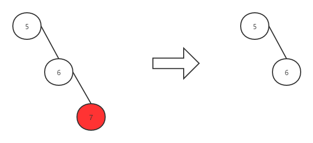
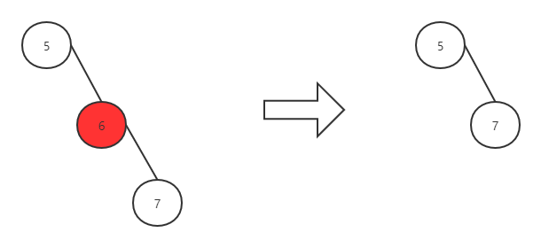
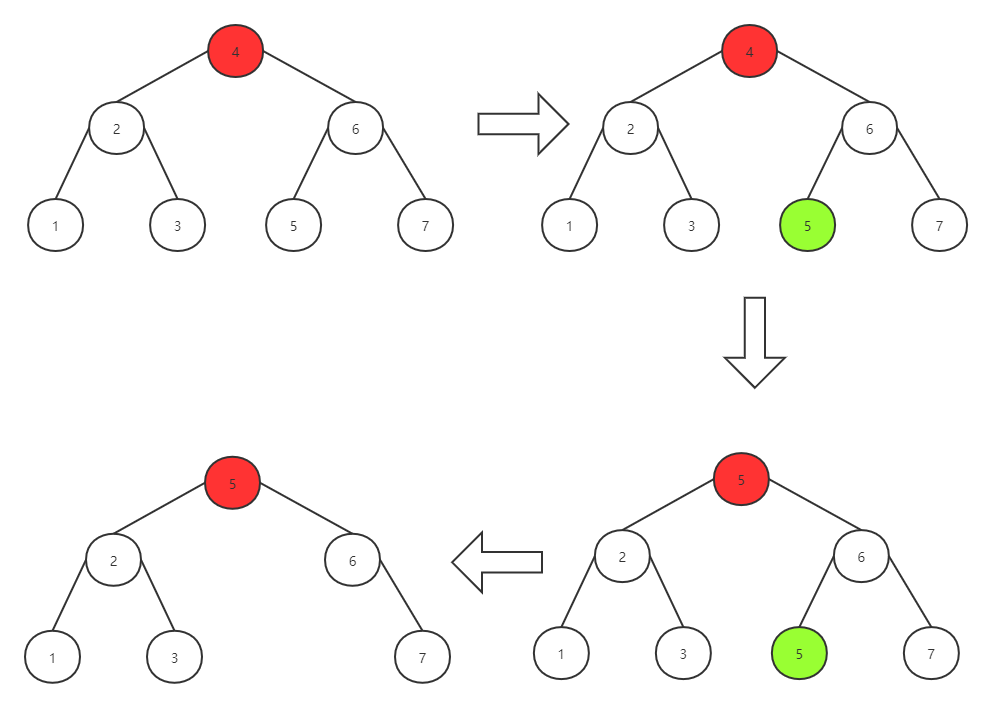

## BST

BST，二叉搜索树，binary  search tree。定义如下：

- 左子树所有节点的值小于当前节点的值
- 右子树所有节点的值大于当前节点的值
- 左子树和右子树也是BST。
<!-- more -->
### 判定

BST的一个比较重要的性质是：中序遍历得到的数列是递增的。

这一点正好可以用于判定一棵二叉树是否是BST。

```c++
static bool Impl(TreeNode* root, int & last, bool & lastValid)
{
    if(root->left && !Impl(root->left, last, lastValid))
        return false;
    if(lastValid && last >= root->val)
        return false;
    last = root->val;
    lastValid = true;
    if(root->right && !Impl(root->right, last, lastValid))
        return false;
    return true;
}
bool isValidBST(TreeNode* root) {
    if(!root)
        return true;
    int last;
    bool lastValid = false;
    return Impl(root, last, lastValid);
}
```

### 删除节点

BST的查找节点太简单了，这里略过。比较值得注意的是BST的删除节点操作，这一思路也被沿用到了AVL中。删除操作比较特殊，是因为在删除节点后，还得要维持BST的性质。

BST的删除主要分为以下几种情况：

一，如果被删除节点是叶子节点，那么直接删除。

二，如果被删除节点只有左儿子或者右儿子节点，那么直接删除该节点，并把它的父亲与它的左/右儿子连在一起。

三，如果被删除节点左右儿子都有，那么选择它右儿子中最小的那个节点作为替死鬼，把这个替死鬼的值赋给当前节点，并把替死鬼节点删掉。当然，选择左儿子中最大的那个节点也是可行的。


